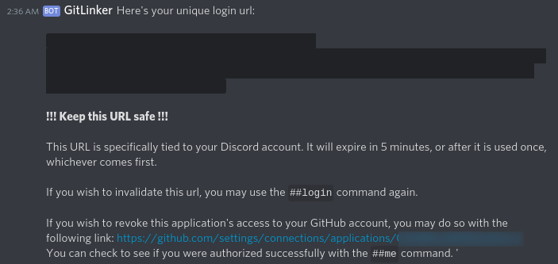
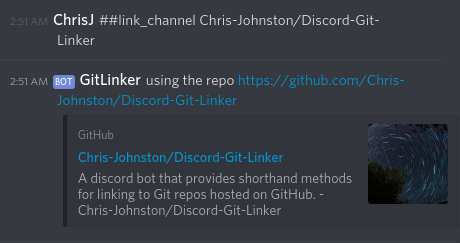
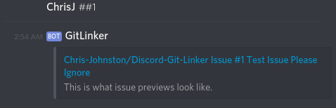
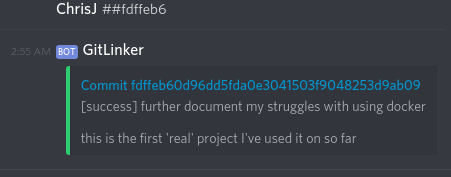

# Discord-Git-Linker [](https://travis-ci.org/Chris-Johnston/Discord-Git-Linker)

A Discord bot for quickly linking to GitHub PRs/Issues/Commits.

# Guide for Users

Briefly, here's how you use this bot:

1. Add the bot to your server.

2. Send the bot a direct message with the command `##login`.

3. The bot should respond with the following:



**Keep this single-use url safe!** If at any point you wish to revoke access to this application,
you may revoke access through your GitHub account.

4. Login and authorize the application to have **private repo access** to your GitHub account.
Priate repo access is requested so that it can work with your private repos.

5. Once you see the confirmation page, go back to your server.

6. Verify that you are logged in with the `##me` command.


7. Link a repository to yourself, a channel, or a server:



8. Start referencing Issues, PRs, and commit hashes!





Repositories wih CI enabled can show build status in the previews!

# Setup

## Installation

This application requires python3.6 to run the bot natively,
or docker.

Install the prerequisites using pip:

```console
python -m pip install -r bot/requirements.txt
python -m pip install -r web/requirements.txt
```

## Configuration

Make a `config.ini` file with the following contents:

```ini
[Configuration]
# your discord bot token
connection_token=tokengoeshere

[GitHub]
# GitHub app client ID
client_id=githubclientid
client_secret=supersecret

[Login]
# This is the URL that users are sent to (with the token as a parameter)
# that redirects them to the github login page
github_login_redirect=http://localhost/github/login
# Link that points to the login endpoint
# This should be the same as the callback url as defined in your github application
github_login_callback=http://localhost/github/code
hostname
```

## Database

Create a new database file if it does not already exist with the following command:

```console
python3.6 web/setup_database.py /path/to/database.db
```

A new file will be created for you.

# Running the bot

The bot consists of two parts, the Discord bot itself, which handles user input,
and the Flask app which handles the GitHub oauth login flow.
While neither component requires the other to run at the same time,
user login requires that both components are active at once.

The two components can be started separately and will run natively, or the
docker compose configuration can be used to start and run both components at once.

## Natively

There are two applications that need to run at once for the bot to run natively.
They must point to the same `config.ini` and `database.db` files to work
correctly.

### Starting the bot

Start the discord bot with the following command:

```console
python3.6 bot/bot.py /path/to/config.ini /path/to/database.db
```

### Starting the Flask app

Start the Flask app with the following command:

```
export WEB_CONFIG_FILE_PATH=/path/to/config.ini
export WEB_DATABASE_FILE_PATH=/path/to/database.db
python3.6 web/app/main.py
```

Note that this solution should really only be used for debugging purposes.

## Running the bot (Docker)

Build the docker images first with:

```console
docker-compose build
```

Then start them with:

```console
docker-compose up
```

To force a rebuild, use:

```console
docker rmi $(docker images -a -q)
docker volume rm discord-git-linker_data-volume
docker-compose up -d --force-recreate --always-recreate-deps --build
```

This can be necessary if the `config.ini` file changes, which is bundled into the image.